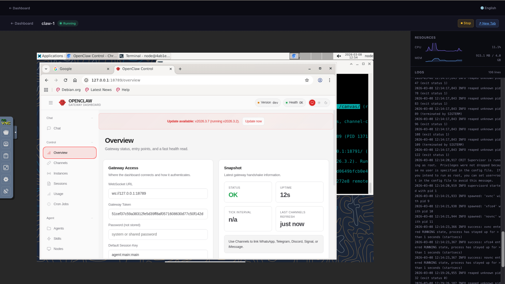

# ClawSandbox

[](https://github.com/weiyong1024/ClawSandbox/releases)
[](https://github.com/weiyong1024/ClawSandbox/blob/main/LICENSE)
[](https://go.dev/)
[](https://www.docker.com/)
[](https://github.com/weiyong1024/ClawSandbox)
[](https://github.com/weiyong1024/ClawSandbox/wiki)

> Deploy and manage a fleet of isolated [OpenClaw](https://github.com/openclaw/openclaw) instances on a single machine — from a browser dashboard, no CLI needed.

[中文文档](./README.zh-CN.md)

---

**You don't need a dedicated server.** If you have a Mac with Apple Silicon, ClawSandbox lets you:

- **Deploy OpenClaw in minutes** — fully sandboxed in Docker, completely isolated from everything else on your machine
- **Run as many as you want** — spin up an entire fleet of OpenClaw instances and experience a one-person company powered by AI

No cloud bills. No new hardware. Everything runs on the machine you already have.

---

## Background

LLM AI applications are evolving through three stages:

1. **ChatBot** — helps everyone access knowledge
2. **Agent** — makes everyone a professional
3. **OpenClaw** — makes everyone a manager

OpenClaw is a self-hosted personal AI assistant that connects to 20+ messaging platforms including WhatsApp, Telegram, and Slack. ClawSandbox removes the deployment bottleneck — instead of struggling to run a single instance, you can spin up an entire fleet with one command.

## What ClawSandbox Does

- **One-command fleet deployment** — give it a number, get that many isolated OpenClaw instances
- **Web Dashboard** — manage your entire fleet from a browser with real-time stats, one-click actions, and embedded noVNC desktops
- **Character system** — define reusable personas (bio, backstory, style, traits) and assign them to instances. Each bot gets a persistent soul that survives across channels and sessions
- **Skill management** — browse 52 built-in skills, search and install from 13,000+ community skills on ClawHub. Different instances can have different skill sets
- **Full desktop per instance** — each claw runs in its own Docker container with an XFCE desktop, accessible via noVNC
- **Lifecycle management** — create, start, stop, restart, and destroy instances via CLI or Dashboard
- **Soul Archive** — save a configured instance's soul and clone it to new instances instantly
- **Auto-recovery** — configured instances automatically restart their gateway after container restarts
- **Data persistence** — each instance's data survives container restarts
- **Resource isolation** — instances are isolated from your host system and from each other

## Requirements

- macOS or Linux
- A Docker environment (e.g. [Docker Desktop](https://www.docker.com/products/docker-desktop/))

## Quick Start

### 1. Install

```bash
git clone https://github.com/weiyong1024/ClawSandbox.git
cd ClawSandbox
make build
# If Go is missing, ClawSandbox bootstraps the Go version from go.mod
# into a user-local toolchain directory automatically.
# Optionally install to PATH (otherwise use ./bin/clawsandbox in place of clawsandbox below):
sudo make install
```

### 2. Launch Dashboard

```bash
clawsandbox dashboard serve
# Open http://localhost:8080
```

### 3. Build Image

Click **"System → Image"** in the Dashboard and build the sandbox image (~1.4 GB, first build takes several minutes).

### 4. Run Your Company

Think of ClawSandbox as **your AI company**. Assets are the tools and resources your company owns; Fleet is your team of AI employees. You assign different tools to different employees, and put your AI workforce into production.

#### Stock your toolbox

**Assets → Models** — register LLM API keys. These are the "brains" your employees think with. Each model is validated before saving.


**Assets → Characters** — define reusable personas. Think of them as "job descriptions" — Tony Stark the CTO, Steve Jobs the CPO, Ray Kroc the CMO. Give each character a bio, backstory, communication style, and personality traits.


**Assets → Channels** — connect messaging platforms (Telegram, Discord, Slack, etc.). These are the "workstations" where your employees serve customers. Optional; validated before saving. Slack follows OpenClaw Socket Mode and uses both a Bot Token and an App Token.


#### Hire & equip your team

**Fleet → Create** — spin up OpenClaw instances. Each one is a new employee joining your company.

**Fleet → Configure** — assign a model, character, and channel to each instance. Give your CTO a Claude brain and a Discord workstation. Give your CMO a GPT brain and a Slack feed. Different employees, different tools, different personalities.


#### Teach them new skills

**Fleet → Skills** — each instance has access to 52 built-in skills (weather, GitHub, coding, and more). Want more? Search 13,000+ community skills on [ClawHub](https://clawhub.com) and install them with one click. Different employees can learn different skills.


#### Save & clone your employees' souls

Once an employee is trained and performing well, save their soul — personality, memory, model config, and conversation history — so you can clone them instantly.

**Fleet → Save Soul** — click on any configured instance to save its soul to the archive.


**Fleet → Soul Archive** — browse all saved souls, ready to be loaded into new hires.


**Fleet → Create → Load Soul** — when creating new instances, pick a soul from the archive. The new employee starts with all the knowledge and personality of the original — no retraining needed.


#### Monitor your workforce

Click **"Desktop"** on any running instance to open its detail page — embedded noVNC desktop, live logs, and real-time resource charts.



#### Watch your team collaborate

Connect your fleet to messaging platforms and watch your AI employees work together. Here, an engineer, product manager, and marketer welcome a new teammate — all running autonomously in a Discord group chat.


## Documentation

See the **[Wiki](https://github.com/weiyong1024/ClawSandbox/wiki)** for full documentation, including:
- [Getting Started](https://github.com/weiyong1024/ClawSandbox/wiki/Getting-Started) — prerequisites, install, first instance
- [Dashboard Guide](https://github.com/weiyong1024/ClawSandbox/wiki/Dashboard-Guide) — sidebar navigation, asset management, fleet management
- LLM Provider guides — [Anthropic](https://github.com/weiyong1024/ClawSandbox/wiki/Provider-Anthropic) | [OpenAI](https://github.com/weiyong1024/ClawSandbox/wiki/Provider-OpenAI) | [Google](https://github.com/weiyong1024/ClawSandbox/wiki/Provider-Google) | [DeepSeek](https://github.com/weiyong1024/ClawSandbox/wiki/Provider-DeepSeek)
- Channel guides — [Telegram](https://github.com/weiyong1024/ClawSandbox/wiki/Channel-Telegram) | [Discord](https://github.com/weiyong1024/ClawSandbox/wiki/Channel-Discord) | [Slack](https://github.com/weiyong1024/ClawSandbox/wiki/Channel-Slack) | [Lark](https://github.com/weiyong1024/ClawSandbox/wiki/Channel-Lark)
- [CLI Reference](https://github.com/weiyong1024/ClawSandbox/wiki/CLI-Reference) | [FAQ](https://github.com/weiyong1024/ClawSandbox/wiki/FAQ)

## CLI Reference

Every command supports `--help` for detailed usage and examples:

```bash
clawsandbox --help              # List all available commands
clawsandbox dashboard --help    # Show dashboard subcommands
```

Quick reference:

```bash
clawsandbox create <N>                  # Create N claw instances (image must be pre-built)
clawsandbox create <N> --pull           # Create N instances, pull image from registry if missing
clawsandbox configure <name>            # Configure an instance with a model and optional channel credentials
clawsandbox list                        # List all instances and their status
clawsandbox desktop <name>              # Open an instance's desktop in the browser
clawsandbox start <name|all>            # Start a stopped instance
clawsandbox stop <name|all>             # Stop a running instance
clawsandbox restart <name|all>          # Restart an instance (stop + start)
clawsandbox logs <name> [-f]            # View instance logs
clawsandbox destroy <name|all>          # Destroy instance (data kept by default)
clawsandbox destroy --purge <name|all>  # Destroy instance and delete its data
clawsandbox snapshot save <name>        # Save an instance's soul to the archive
clawsandbox snapshot list               # List all saved souls
clawsandbox snapshot delete <name>      # Delete a saved soul
clawsandbox create 1 --from-snapshot <soul>  # Create instance from a saved soul
clawsandbox dashboard serve              # Start the Web Dashboard
clawsandbox dashboard stop               # Stop the Web Dashboard
clawsandbox dashboard restart            # Restart the Web Dashboard
clawsandbox dashboard open               # Open the Dashboard in your browser
clawsandbox build                        # Build image locally (offline/custom use)
clawsandbox config                       # Show current configuration
clawsandbox version                      # Print version info
```

## Reset

To destroy all instances (including data), stop the Dashboard, and remove all build artifacts — effectively returning to a clean slate:

```bash
make reset
```

After resetting, start over from [Quick Start](#quick-start) step 1.

## Resource Usage

Tested on M4 MacBook Air (16 GB RAM):

| Instances | RAM (idle) | RAM (Chromium active) |
|-----------|------------|-----------------------|
| 1         | ~1.5 GB    | ~3 GB                 |
| 3         | ~4.5 GB    | ~9 GB                 |
| 5         | ~7.5 GB    | not recommended       |

## Project Status

Actively developed. Both CLI and Web Dashboard are functional.

Contributions and feedback welcome — please open an issue or PR.

If you run into any problems, feel free to reach out: weiyong1024@gmail.com

## License

MIT
